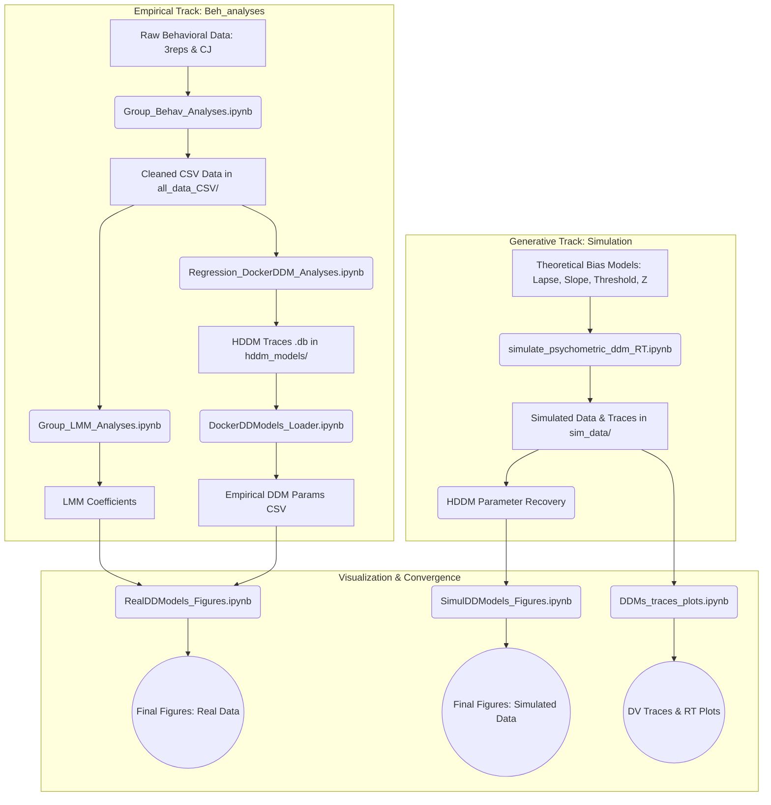

# Condcision Behavioral Analysis

**Condcision** is a data science project investigating the behavioral and cognitive mechanisms underlying decision-making and confirmation bias. This repository contains the code for processing, statistically analyzing, and modeling behavioral data collected from human participants.

The project specifically focuses on analyzing data from two experimental variants:
1. **`3reps`**: An experiment exploring how sequential repetitions influence perceptual decisions.
2. **`CJ`**: An experiment incorporating Confidence Judgments into the decision-making process.

The analysis framework utilizes Signal Detection Theory (SDT), generalized Linear Mixed-Effects Models (GLMMs), and Hierarchical Drift-Diffusion Models (HDDM). Furthermore, the empirical results are validated against generative computational models that simulate different theoretical bias strategies (e.g., sensory vs. decisional biases).

---

## Analysis Pipeline

The pipeline is divided into two major parallel tracks: **Empirical Data Analysis** (found in `Beh_analyses/`) and **Generative Modeling & Simulation** (found in `Simulation/`). These tracks converge at the final visualization stage, where empirical findings are compared against the simulated ground truths.

> [!WARNING]
> **Important Note on File Paths:**
> Some analysis scripts may contain hardcoded paths based on an older local directory structure. If you encounter `FileNotFoundError`s while running the notebooks (especially in `Group_Behav_Analyses.ipynb` or the `condicision3reps` preprocessing folder), ensure the paths accurately point to your local directories.

---

### PART I: EMPIRICAL DATA ANALYSIS (`Beh_analyses/`)

#### 1. Data Preprocessing & Basic Behavioral Analyses
**Key Notebooks:** `Group_Behav_Analyses.ipynb`, `condicision3reps/condicision_3reps_preproc.ipynb`, `condcision_CJ/condicision_cj_preproc.ipynb`

**Objective:** Clean raw data, compute basic metrics, and format data for statistical modeling.
* **Data Cleaning & Formatting:** Loads raw data for the `3reps` and `CJ` experiment variants, recodes variables (motor actions, trial types), and creates unique subject IDs. The data is restructured into a "long format" which is required for trial-by-trial mixed-effects modeling.
* **SDT & Metacognitive Metrics:** Computes standard Signal Detection Theory metrics (Accuracy, d-prime, criterion $c$). It also uses the `metadpy` library to calculate metacognitive efficiency (meta-d') and derives a proxy for confidence based on Response Times (RT) for experiments lacking explicit confidence judgments.
* **Export:** The concatenated and cleaned datasets are saved as CSV files into the `all_data_CSV` folder for use in subsequent analysis steps.

#### 2. Linear Mixed-Effects Modeling (LMM)
**Key Notebooks:** `Group_LMM_Analyses.ipynb`

**Objective:** Statistically model the trial-by-trial behavioral responses accounting for fixed and random effects.
* **Model Fitting:** Uses `pymer4` (a Python interface to R's `lme4`) to fit generalized linear mixed-effects models (GLMMs) on the behavioral data.
* **Regressors:** The models predict participant responses based on factors like Decision Value (DV), distance/similarity to the previous stimulus, number of sequence repetitions, confidence, meta-dprime, and previous choices.
* **Interactions:** Tests complex interactions (e.g., how the effect of repetition interacts with metacognitive efficiency or confidence).
* **Export:** Fitted models and their coefficients are saved into a dictionary/pickle file (`LLMs_models`) to be easily loaded later for visualization.

#### 3. Empirical Drift Diffusion Modeling (HDDM)
**Key Notebooks:** `Regression_DockerDDM_Analyses.ipynb`, `DockerDDModels_Loader.ipynb`, `Group_DockerDDM_Analyses.ipynb`

**Objective:** Uncover the latent cognitive processes driving decisions by fitting Hierarchical Drift Diffusion Models (HDDM).
* **HDDM Setup:** Uses the `hddm` package (typically run inside a Docker container due to dependency requirements) to fit Bayesian models to reaction time and choice data.
* **Regression within DDM:** Fits various regression models where DDM parameters (primarily drift rate $v$, but also boundary separation $a$ or starting point $z$) vary as a function of the experimental condition (e.g., stimulus weight, DV distance, sequence similarity, confidence, meta-d').
* **Parameter Aggregation:** Because HDDM outputs large database trace files (`.db`), `DockerDDModels_Loader.ipynb` is used to load these traces and compile the posterior distributions of the parameters into a single, manageable CSV table.

---

### PART II: GENERATIVE MODELING & SIMULATION (`Simulation/`)

#### 4. Synthetic Data Generation & Theoretical Bias Models
**Key Notebooks:** `simulate_psychometric_ddm_RT.ipynb`, `DDMs_traces_plots.ipynb`

**Objective:** Simulate synthetic datasets under different theoretical bias models and validate the HDDM framework's ability to recover these biases.

* **Psychometric Generation:** Generates synthetic datasets (`create_exp()`) using a custom psychometric function.
* **Injecting Biases:** The simulation artificially injects different theoretical bias mechanisms into the synthetic observers to mimic different cognitive strategies:
  * **Selective Bias (Lapse model):** Alters the upper and lower asymptotic bounds of the psychometric curve based on the sequence history.
  * **Selective Bias (Slope model):** Modifies the sensitivity (slope of the curve) dynamically, assuming sensitivity changes with the distance of the sample to the previous choice.
  * **Non-Selective Bias (Threshold model):** Shifts the decision threshold ($c$) irrespective of the stimulus strength.
  * **Z Model:** Directly shifts the starting point ($z$) of evidence accumulation in the Drift Diffusion Model.
* **HDDM Parameter Recovery:** Fits HDDM models (varying drift criteria `dc`, starting points `z`, or using `nohist` settings) to the synthetic datasets. This tests whether HDDM can successfully recover the "true" generative parameters and maps how the distinct generative biases (e.g., slope vs. threshold) manifest in the recovered DDM parameters.
* **Export:** Simulated datasets are saved as pickles (e.g., `all_simdata.pickle`, `all_sims.pickle` into `sim_data/`).

---

### PART III: VISUALIZATION & CONVERGENCE

#### 5. Final Visualization & Figure Generation
**Key Notebooks:** `RealDDModels_Figures.ipynb` (in `Beh_analyses/`), `SimulDDModels_Figures.ipynb` (in `Beh_analyses/`), and `DDMs_traces_plots.ipynb` (in `Simulation/`)

**Objective:** Generate the final plots and figures for the manuscript or presentations, contrasting empirical data with simulated ground truths.
* **Real Data Figures (`RealDDModels_Figures.ipynb`):** Loads the previously saved LMM model coefficients and the empirical DDM parameter CSV tables for the `3reps` and `CJ` variants. It plots psychometric curves, SDT comparisons, regression betas (showing the effect of previous choice, within-sequence congruence, etc.), and compares models using AIC/BIC.
* **Simulated Data Figures (`SimulDDModels_Figures.ipynb`):** Performs an identical visualization process on the simulated data to map the theoretical predictions against the empirical data.
* **Trace Plotting (`DDMs_traces_plots.ipynb`):** Generates visual representations of the simulated decision variable (DV) traces accumulating towards the decision boundaries, paired with their resulting Reaction Time (RT) distributions, to visually confirm the mechanical differences between the different bias models.

---

### Pipeline Summary Flowchart

